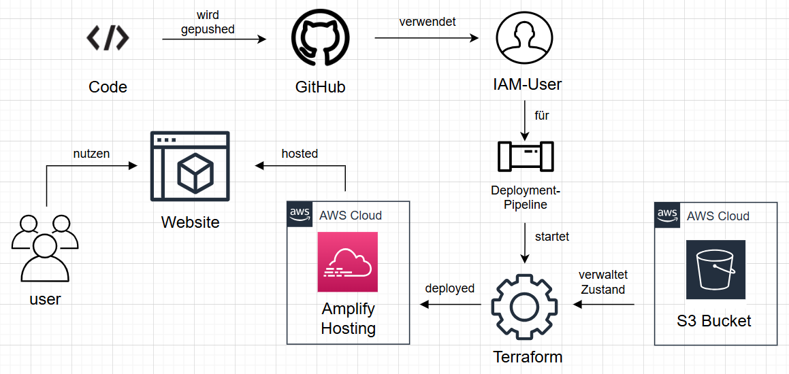

AWS Website Hosting
  

DLBSEPCP01_D - Cloud Programming
  

Portfolio - Erarbeitung
  

**Aufbau des Projektes:**  
/.github/worflows/deploy.yml - Ausführungspipeline beim push auf main  
/images/amplify_hosting_diagramm.png - Diagramm zum Projekt  
/images/iu_logo.png - Logo der IU  
index.html - Code für die zu hostende statische Website  
main.tf - Terraform Code  
README  

**Funktion des Projektes:**  
Hosting einer Statischen Website über AWS Amplify Hosting  

  

